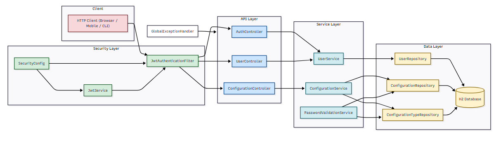

# springboot-user-registration

## 📋 Descripción general

Este proyecto es un sistema de registro de usuarios construido con Spring Boot. Proporciona APIs RESTful para el registro, autenticación y gestión de usuarios.

## 📂 Estructura del proyecto

- `controller/` - Controladores REST
- `service/` - Lógica de negocio
- `repository/` - Acceso a datos
- `model/` - Entidades JPA
- `dto/` - Objetos de transferencia de datos
- `exception/` - Excepciones personalizadas y manejadores
- `config/` - Clases de configuración
- `mapper/` - Mapeo entre entidades y DTOs
- `security/` - Configuración y utilidades de seguridad
- `utils/` - Utilidades generales


## 📊 Diagrama de la solución

El siguiente diagrama muestra la arquitectura de la aplicación, incluyendo los componentes principales y sus interacciones:



Este diagrama muestra:

1. **Capa de Presentación**: Los controladores REST que reciben las peticiones HTTP y las dirigen a los servicios correspondientes.
2. **Capa de Seguridad**: El filtro de autenticación JWT que valida los tokens en las peticiones.
3. **Capa de Servicio**: Los servicios que implementan la lógica de negocio.
4. **Capa de Persistencia**: Los repositorios que interactúan con la base de datos.

## ✨ Funcionalidades
- Registro de usuarios con validación
- Autenticación de usuarios (login)
- Almacenamiento seguro de contraseñas
- Endpoints para gestión de usuarios
- Manejo de excepciones
- Configuración de expresiones regulares para validación de contraseñas

## 🛠️ Tecnologías utilizadas
- Java
- Spring Boot
- Spring Data JPA
- H2 (base de datos en memoria)
- Gradle
- Lombok
- SLF4J (Logger)
- Springdoc OpenAPI (para documentación y anotaciones @Schema en los DTOs)
- MapStruct (para mapeo entre entidades y DTOs)

## 🚀 Primeros pasos

### 📋 Prerrequisitos
- Java 17 o superior
- Gradle

### ▶️ Ejecución de la aplicación

1. Clone el repositorio:
   ```bash
   git clone <repository-url>
   cd springboot-user-registration
   ```
2. Compile y ejecute la aplicación:
   ```bash
   ./gradlew bootRun
   ```
3. La aplicación estará disponible en `http://localhost:8080` por defecto.


### 🔗 Endpoints principales

- `POST /api/users/register` - Registrar un nuevo usuario
- `POST /api/auth/login` - Autenticar un usuario
- `GET /api/users` - Listar todos los usuarios (requiere autenticación)
- `GET /api/configurations` - Listar todas las configuraciones activas (requiere autenticación)
- `GET /api/configurations/{typeKey}` - Obtener una configuración específica por su tipo (requiere autenticación)
- `PUT /api/configurations` - Actualizar una configuración existente o crear una nueva (requiere autenticación)
- `PUT /api/configurations/{typeKey}?value=nuevoValor` - Actualizar una configuración por su tipo (requiere autenticación)

### 📝 Uso de la aplicación

#### 🔄 Consumo de endpoints con Postman

A continuación se muestra cómo consumir todos los endpoints de la API utilizando Postman:

##### 👤 Registro de usuarios

> **Nota sobre validación de contraseñas**: Actualmente, el sistema está configurado para validar contraseñas con los siguientes criterios: mínimo 8 caracteres, máximo 30 caracteres, al menos 1 letra mayúscula, 1 letra minúscula, 1 dígito y 1 carácter especial (entre -.#$%&). Estos parámetros pueden ser configurados a través de la API.

1. Abra Postman
2. Cree una nueva solicitud POST a `http://localhost:8080/api/users/register`
3. En la pestaña "Headers", agregue `Content-Type: application/json`
4. En la pestaña "Body", seleccione "raw" y "JSON", y agregue el siguiente contenido:
   ```json
   {
     "name": "Juan Rodriguez",
     "email": "juan@rodriguez.cl",
     "password": "Prueba.123$#-",
     "phones": [
       {
         "number": "1234567",
         "citycode": "1",
         "contrycode": "57"
       }
     ]
   }
   ```
5. Haga clic en "Send" para enviar la solicitud

##### 🔐 Autenticación de usuarios

1. Abra Postman
2. Cree una nueva solicitud POST a `http://localhost:8080/api/auth/login`
3. En la pestaña "Headers", agregue `Content-Type: application/json`
4. En la pestaña "Body", seleccione "raw" y "JSON", y agregue el siguiente contenido:
   ```json
   {
     "email": "juan@rodriguez.cl",
     "password": "Prueba.123$#-"
   }
   ```
5. Haga clic en "Send" para enviar la solicitud

##### ⚙️ Sistema de configuración

El sistema permite personalizar los requisitos de contraseña a través de la API de configuraciones. Esto es especialmente útil para ajustar las políticas de seguridad según las necesidades específicas de su organización.

> **Configuraciones disponibles para contraseñas**:
> - `password.min.length`: Longitud mínima de caracteres (valor predeterminado: 8)
> - `password.max.length`: Longitud máxima de caracteres (valor predeterminado: 30)
> - `password.min.uppercase`: Cantidad mínima de letras mayúsculas (valor predeterminado: 1)
> - `password.min.lowercase`: Cantidad mínima de letras minúsculas (valor predeterminado: 1)
> - `password.min.digits`: Cantidad mínima de dígitos (valor predeterminado: 1)
> - `password.min.special`: Cantidad mínima de caracteres especiales (valor predeterminado: 1)
> - `password.allowed.special`: Caracteres especiales permitidos (valor predeterminado: "-.#$%&")

##### ⚙️ Obtener todas las configuraciones

1. Abra Postman
2. Cree una nueva solicitud GET a `http://localhost:8080/api/configurations`
3. En la pestaña "Headers", agregue `Authorization: Bearer YOUR_JWT_TOKEN` (reemplace YOUR_JWT_TOKEN con el token obtenido al autenticarse)
4. Haga clic en "Send" para enviar la solicitud

##### ⚙️ Obtener una configuración específica

1. Abra Postman
2. Cree una nueva solicitud GET a `http://localhost:8080/api/configurations/password.min.length`
3. En la pestaña "Headers", agregue `Authorization: Bearer YOUR_JWT_TOKEN` (reemplace YOUR_JWT_TOKEN con el token obtenido al autenticarse)
4. Haga clic en "Send" para enviar la solicitud

##### ⚙️ Actualizar una configuración

1. Abra Postman
2. Cree una nueva solicitud PUT a `http://localhost:8080/api/configurations/password.min.length?value=10`
3. En la pestaña "Headers", agregue `Authorization: Bearer YOUR_JWT_TOKEN` (reemplace YOUR_JWT_TOKEN con el token obtenido al autenticarse)
4. Haga clic en "Send" para enviar la solicitud

##### ⚙️ Actualizar una configuración usando JSON

1. Abra Postman
2. Cree una nueva solicitud PUT a `http://localhost:8080/api/configurations`
3. En la pestaña "Headers", agregue `Content-Type: application/json`
4. En la pestaña "Headers", agregue `Authorization: Bearer YOUR_JWT_TOKEN` (reemplace YOUR_JWT_TOKEN con el token obtenido al autenticarse)
5. En la pestaña "Body", seleccione "raw" y "JSON", y agregue el siguiente contenido:
   ```json
   {
     "configurationTypeId": 1,
     "configValue": "10"
   }
   ```
6. Haga clic en "Send" para enviar la solicitud

> **Nota**: Al modificar las configuraciones de contraseña, los nuevos valores se aplicarán inmediatamente a todos los nuevos registros de usuarios. Esto permite ajustar dinámicamente las políticas de seguridad sin necesidad de reiniciar la aplicación.


### 🧪 Pruebas

Ejecute las pruebas con:
```bash
./gradlew test
```

## 📂 Estructura del proyecto

- `controller/` - Controladores REST
- `service/` - Lógica de negocio
- `repository/` - Acceso a datos
- `model/` - Entidades JPA
- `dto/` - Objetos de transferencia de datos
- `exception/` - Excepciones personalizadas y manejadores
- `config/` - Clases de configuración
- `mapper/` - Mapeo entre entidades y DTOs
- `security/` - Configuración y utilidades de seguridad
- `utils/` - Utilidades generales

## 📝 Logging

Este proyecto utiliza SLF4J para el registro de mensajes informativos, advertencias y errores. Ejemplo de uso:

```java
import org.slf4j.Logger;
import org.slf4j.LoggerFactory;

public class YourClass {
    private static final Logger logger = LoggerFactory.getLogger(YourClass.class);

    public void ejemploLogger() {
        logger.info("Mensaje informativo");
        logger.warn("Mensaje de advertencia");
        logger.error("Mensaje de error");
    }
}
```


## 📄 Licencia

Este proyecto está licenciado bajo MIT License.

---

## 📚 Documentación

A continuación se presentan los enlaces a la documentación disponible en el proyecto:

### 📘 Documentación de la API
- ✅ **Swagger UI:** [`http://localhost:8080/swagger-ui/index.html`](http://localhost:8080/swagger-ui.html)

### 🗃️ Base de datos
- 📊 **Documentación de la base de datos:** [`docs/database/README.md`](docs/database/README.md)

### 🔒 Seguridad
- 🔐 **Documentación de seguridad y JWT:** [`docs/security/README.md`](docs/security/README.md)

### 🛠️ Utilidades
- 📚 **Índice de utilidades:** [`docs/utils/README.md`](docs/utils/README.md)
- 📝 **Tipos de configuración de contraseñas:** [`docs/utils/README-PasswordConfigurationType.md`](docs/utils/README-PasswordConfigurationType.md)
- 🔍 **Generación de expresiones regulares:** [`docs/utils/README-PasswordRegexGenerator.md`](docs/utils/README-PasswordRegexGenerator.md)
- ✅ **Validación de contraseñas:** [`docs/utils/README-PasswordValidator.md`](docs/utils/README-PasswordValidator.md)
- 🔐 **Cifrado de contraseñas:** [`docs/utils/README-PasswordEncoderUtil.md`](docs/utils/README-PasswordEncoderUtil.md)

### 🔄 Mappers
- 🔄 **Documentación de mappers:** [`docs/mappers/README.md`](docs/mappers/README.md)

### 🛡️ Excepciones
- 🛡️ **Documentación de manejo de excepciones:** [`docs/exceptions/README.md`](docs/exceptions/README.md)

### 📝 Ejercicio propuesto
- 📋 **Descripción del ejercicio:** [`docs/exercise/integration_proposed_exercise.md`](docs/exercise/integration_proposed_exercise.md)

---

### 🔄 Cambios recientes
- 🔐 Se agregó documentación sobre las limitaciones actuales y mejoras futuras en seguridad, especificando que la generación de refresh tokens no está dentro del alcance actual del proyecto pero debería implementarse en el futuro.
- 🔧 Se implementó un controlador para la gestión de configuraciones del sistema, permitiendo editar los valores de validación de contraseñas.
- 🔄 Se crearon mappers para las entidades Configuration y ConfigurationType utilizando MapStruct.
- 🛡️ Se agregó documentación detallada sobre el manejo de excepciones y posibles mejoras futuras.
- ✅ Se implementaron utilidades para la validación de contraseñas basadas en configuraciones almacenadas en la base de datos.
- 📚 Se agregó documentación detallada sobre las utilidades de validación de contraseñas.
- 🔄 Se actualizó la documentación para reflejar el uso de H2 como base de datos en memoria, eliminando referencias a PostgreSQL, Docker y .env para la base de datos.
- 📋 Se actualizó la documentación de la base de datos para incluir información detallada sobre el esquema de la base de datos y las entidades JPA implementadas.
- 🔄 Se agregó documentación sobre el uso de MapStruct como biblioteca para el mapeo entre entidades y DTOs.
